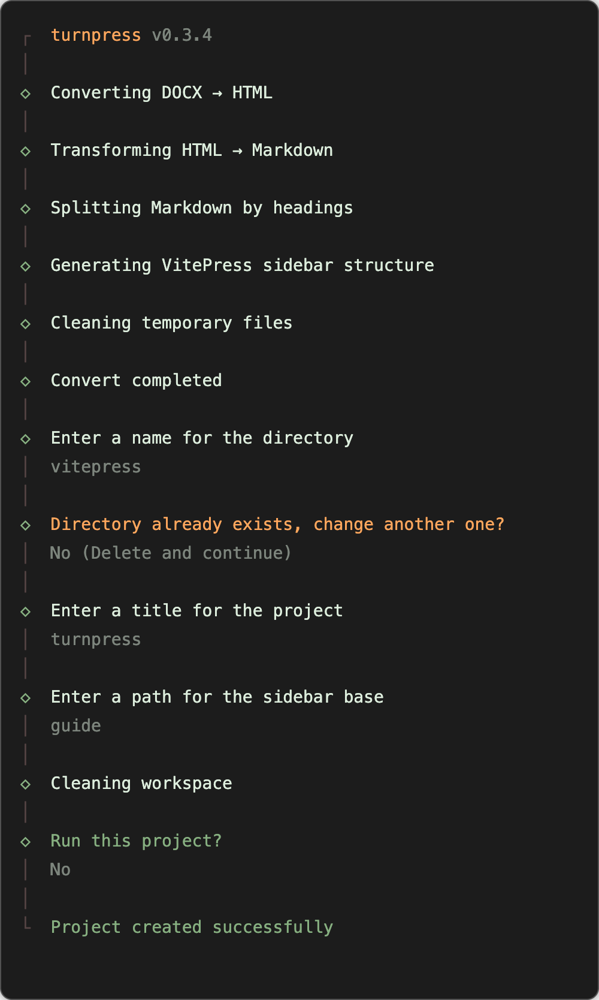

# turnpress

[![npm version][npm-version-src]][npm-version-href]
[![bundle][bundle-src]][bundle-href]
[![JSDocs][jsdocs-src]][jsdocs-href]
[![License][license-src]][license-href]

TurnPress is a CLI tool that converts both Markdown (.md) and Word (.docx) files into Vitepress-compatible Markdown format. It utilizes Pandoc for document conversion and Turndown for HTML-to-Markdown transformation, automatically splitting and structuring content for seamless Vitepress integration.

> [!NOTE]
> Pandoc is required when converting DOCX files. Please ensure you have Pandoc installed if you need to process Word documents. Markdown conversion works without Pandoc.

```sh
npx turnpress --docx ./test.docx
```

<p align='center'>

</p>

## Features

### Convert

```sh
npx turnpress convert --docx ./test.docx
# or for Markdown files
npx turnpress convert --md ./input.md
```

The `convert` command processes your document and generates a structured output ready for integration into an existing VitePress project. It:

- **Splits content by headings**: Automatically creates separate files for each heading level
- **Generates sidebar structure**: Creates a `sidebar.json` file with proper navigation
- **Extracts and organizes media**: Handles images and other assets
- **Optimizes for VitePress**: Ensures compatibility with VitePress's requirements

Perfect for when you want to add new documentation to an existing VitePress site.

### Create

```sh
npx turnpress create --docx ./test.docx
# or for Markdown files
npx turnpress create --md ./input.md
```

The `create` command goes beyond conversion by setting up a complete new VitePress project. It:

- **Performs all conversion tasks**: Same as the convert command
- **Generates project structure**: Creates a full VitePress project with proper configuration
- **Interactive setup**: Prompts for project name, title, and other settings
- **Ready to run**: Installs dependencies and can start the development server immediately

Ideal for creating new documentation sites from scratch.

## Configuration

Create a `turnpress.config.ts` file to customize behavior:

```ts
import { defineConfig } from 'turnpress'

export default defineConfig({
  pandoc: '/opt/homebrew/bin/pandoc',
})
```

You can also use command-line options to customize behavior:

- **`--file, -f <path>`**: Input file path (auto-detects file type)
- **`--docx <path>`**: Path to the `.docx` file
- **`--md <path>`**: Path to the `.md` file
- **`--pandoc <path>`**: Custom path to the Pandoc executable
- **`--workspace, -w <dir>`**: Work directory where generated files are saved (default: `./turnpress`)

## How it Works

1. **For DOCX files**:
   - Pandoc converts `.docx` → HTML
   - Turndown transforms HTML → structured Markdown
2. **For Markdown files**:
   - Directly processes and optimizes existing Markdown
3. **Vitepress Optimization** (for both):
   - Splits documents by headings (e.g., `#` → separate files)

## Why turnpress?

Some teams prefer writing documentation in DOCX or Markdown format but need to deploy it as an offline documentation site. While Pandoc can convert DOCX to Markdown directly and Markdown requires optimization, the output often doesn't follow standard structure and may have compatibility issues with Vitepress. That's why I use Turndown to convert the HTML output from Pandoc for DOCX files and direct processing for Markdown files to achieve better results.

## License

[MIT](./LICENSE) License © [jinghaihan](https://github.com/jinghaihan)

<!-- Badges -->

[npm-version-src]: https://img.shields.io/npm/v/turnpress?style=flat&colorA=080f12&colorB=1fa669
[npm-version-href]: https://npmjs.com/package/turnpress
[npm-downloads-src]: https://img.shields.io/npm/dm/turnpress?style=flat&colorA=080f12&colorB=1fa669
[npm-downloads-href]: https://npmjs.com/package/turnpress
[bundle-src]: https://img.shields.io/bundlephobia/minzip/turnpress?style=flat&colorA=080f12&colorB=1fa669&label=minzip
[bundle-href]: https://bundlephobia.com/result?p=turnpress
[license-src]: https://img.shields.io/badge/license-MIT-blue.svg?style=flat&colorA=080f12&colorB=1fa669
[license-href]: https://github.com/jinghaihan/turnpress/LICENSE
[jsdocs-src]: https://img.shields.io/badge/jsdocs-reference-080f12?style=flat&colorA=080f12&colorB=1fa669
[jsdocs-href]: https://www.jsdocs.io/package/turnpress
